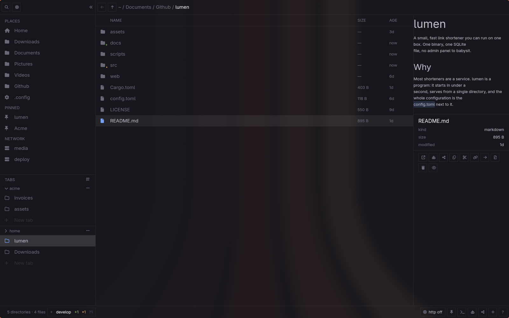

# Omafiles

The file explorer Omarchy was missing. Keyboard-first, themed by Omarchy,
one binary.



A modern explorer built for omarchs. Serve a directory in a keystroke, ask an
agent about a file, read a diff where the preview goes, find by name and
content in one window. It runs on Omarchy's own scripts and tokens, so it looks
and behaves like the rest of your desktop, and it retints live when you switch
theme.

## Features

- **Everything is a keystroke.** Vim-ish movement, key contexts per pane, a
  command palette (`^k`) that shows every action with its effective binding,
  and a keymap you can rebind from a TOML file. The mouse gets the same verbs,
  never more.
- **Find.** One window (`/`) for everything below here: recent files when the
  query is empty, fuzzy names as you type, then content matches via ripgrep.
- **Preview.** Images, video posters, markdown, and code through tree-sitter,
  coloured by your palette. Expand it over the listing with `space` and flick
  through files with `j` and `k`.
- **Git.** Branch and change counts in the status bar, markers on entry
  icons, and a changed file previews as its diff, rendered as the file rather
  than the patch. Switch branches with `^⇧g`.
- **Serve.** Any directory over HTTP in one keystroke (`^s`). Servers are
  detached processes: close the window, they keep answering.
- **Act.** Terminal here, agent chat about a file, share via LocalSend, copy,
  cut, paste, zip, trash, new file or directory. Select several entries and
  drag them onto a directory, a tab or a place to move them. All through
  Omarchy's own scripts, so your defaults hold.
- **Vertical tabs and workspaces.** Tabs live in the sidebar, grouped by
  project. Drag to reorder or regroup them. Each carries its own history and
  cursor, and everything restores across restarts and syncs across windows.
- **Network.** SMB, SFTP and WebDAV through GVfs. A mount is just a directory:
  listing, preview and search browse it with no special cases.

Press `?` inside the app for the full shortcut sheet.

## Install

Prebuilt for Omarchy (Arch Linux, x86_64). Grab the package from the
[latest release](https://github.com/aloisdeniel/omafiles/releases/latest):

```sh
curl -LO https://github.com/aloisdeniel/omafiles/releases/latest/download/omafiles-0.0.3-1-x86_64.pkg.tar.zst
sudo pacman -U omafiles-0.0.3-1-x86_64.pkg.tar.zst
```

pacman installs the runtime dependencies (`git`, `ffmpeg`, `xdg-utils`),
the `.desktop` entry, and removes it all again with `pacman -R omafiles`.

To build from source instead (a ~15 minute gpui build):

```sh
git clone https://github.com/aloisdeniel/omafiles
cd omafiles/contrib && makepkg -si
```

Everything that touches your home directory (default file manager, the
`SUPER+SHIFT+F` binding, the theme hook) is opt-in and documented in
[`contrib/README.md`](contrib/README.md).

## Configure

All files live under `~/.config/omafiles/` and are optional.

| File | What it holds |
| --- | --- |
| `keymap.toml` | Your bindings, merged over the defaults. Names are the palette's action names. |
| `config.toml` | The few settings that are not keys, e.g. `button_labels = true` to spell out the verbs on the action buttons. |
| `places.toml` | The pinned directories in the sidebar. Written by the app when you pin. |
| `network.toml` | Saved network locations. |
| `views.toml` | Per-directory listing layout: the sort column and direction, and the column widths, written when you click a header or drag a divider. |

## Development

A Rust workspace of three crates:

| Crate | Role |
| --- | --- |
| `omarchy-tokens` | Reads Omarchy's theme into typed tokens. Conformance-tested against Omarchy's own tooling on every stock theme. |
| `omarchy-ui` | A small gpui design system built from those tokens: rows, buttons, modals, badges. |
| `omafiles` | The explorer. |

```sh
cargo test --workspace
cargo build --release --locked -p omafiles
```

`--locked` matters: the committed `Cargo.lock` is the gpui pin, and an unlocked
build defeats it. Design notes are in [`plan/`](plan/), and
[`contrib/screenshots/take.sh`](contrib/screenshots/take.sh) takes the showcase
screenshots in a throwaway home on your Hyprland session.

## Releasing

Bump `version` in `Cargo.toml`, commit, tag `vX.Y.Z` and push. The release
workflow builds the pacman package and publishes it. Full process, including
the optional AUR step, in [`docs/RELEASE.md`](docs/RELEASE.md).

## License

MIT.
